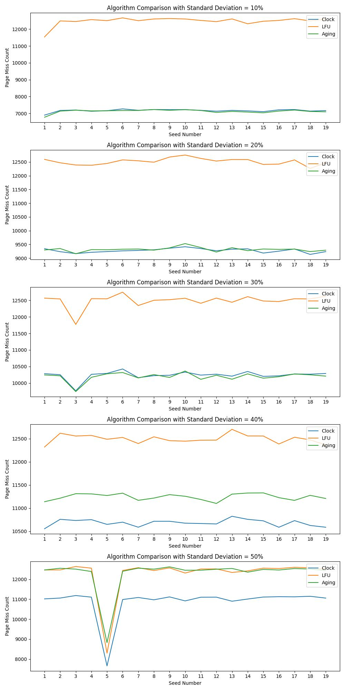

# Page Replacement Algorithms

This repository contains a project developed by a group of four students for a Systems Operating course at the Federal University of São Paulo, under the guidance of Dr. Professor Bruno Kimura.

## Group Members

- [**Arthur Oliveira**](https://github.com/Arthur-so)
- [**Gabriel Augusto**](https://github.com/gbeloso)
- [**Manoel Serafim**](https://github.com/manoel-serafim)
- [**Matheus Silva**](https://github.com/matheuxito)

## Overview

The **PageReplacementAlgorithms** project focuses on the comparison of three different page replacement algorithms: **LFU** (Least Frequently Used), **Clock**, and **Aging**. The objective is to evaluate and identify the most effective algorithm based on the page miss rate.

The project analyzes both virtual and physical memory, conducting tests based on standard deviations. The page miss rates are calculated for standard deviations of 10%, 20%, ..., up to 50%. This allows us to understand and determine the optimal page replacement algorithm.

## Comparison Results



The image above shows the graphical comparison of the page miss rates for the three algorithms. It provides a visual representation of their performance under various standard deviation scenarios.

## Usage

To run the code, follow these steps:

1. Clone the repository using the following command:
   ```
   git clone https://github.com/manoel-serafim/PageReplacementAlgorithms.git
   ```

2. Navigate to the repository directory:
   ```
   cd PageReplacementAlgorithms
   ```

3. Run the `final_program` executable, providing a seed for randomization:
   ```
   ./final_program <SEED>
   ```
   Replace `<SEED>` with your desired seed value.

To generate the comparison graphs, perform the following steps:

1. Create a virtual environment:
   ```
   python -m venv env
   ```

2. Activate the virtual environment:
   - On Windows:
     ```
     env\Scripts\activate
     ```
   - On Linux/macOS:
     ```
     source env/bin/activate
     ```

3. Install the dependencies:
   ```
   pip install -r requirements.txt
   ```

4. Open the `page_replacement_algorithms.ipynb` Jupyter Notebook and run all cells.

Executing the notebook will generate the comparative graphs for the page replacement algorithms.

## License

The **PageReplacementAlgorithms** project is licensed under the [MIT License](LICENSE). Feel free to use and modify the code according to your needs.
